# KinDee screen captures

Viewport: 390 × 844 CSS pixels, device scale factor 2.

## Authentication

### Splash / guest-first
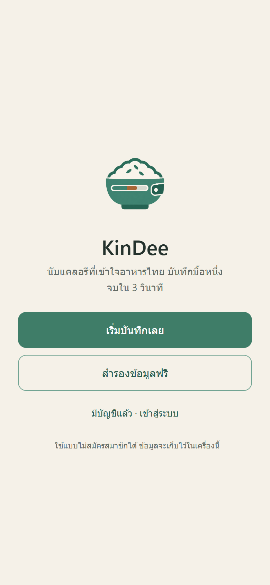

### Sign up
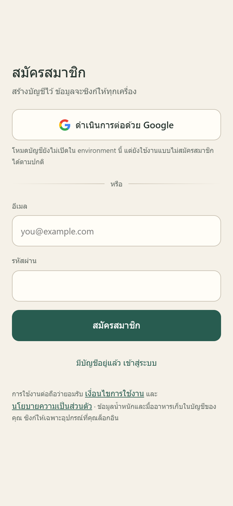

### Sign in
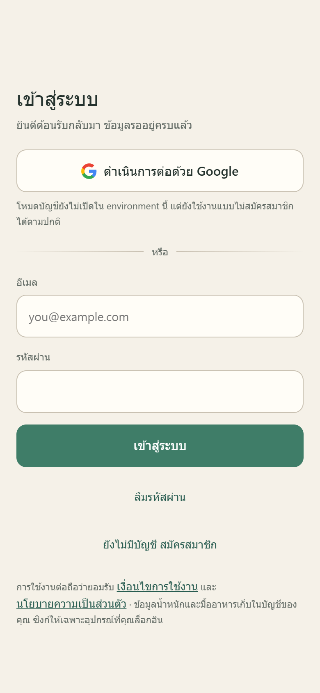

### Terms and privacy
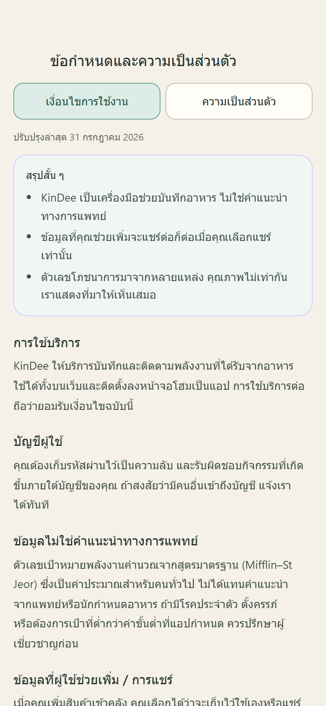

## Onboarding

### Profile
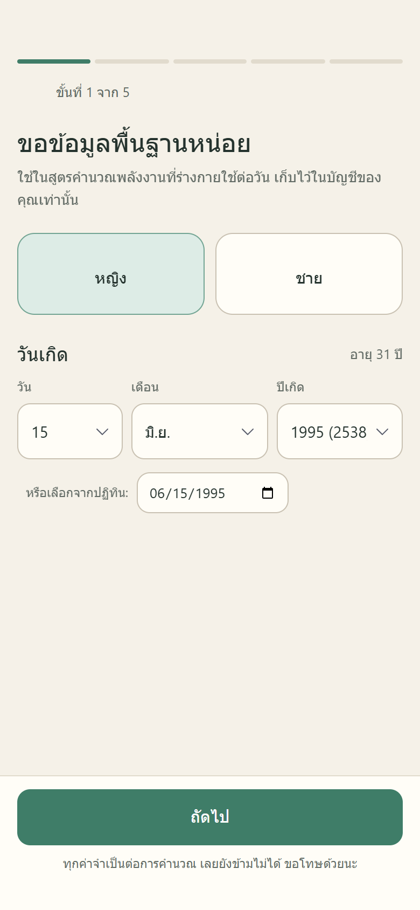

### Body measurements
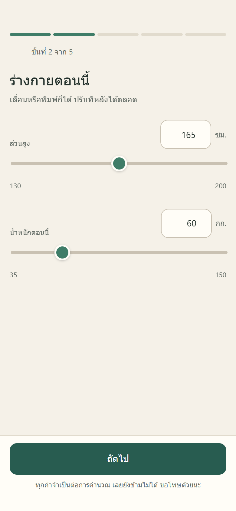

### Activity
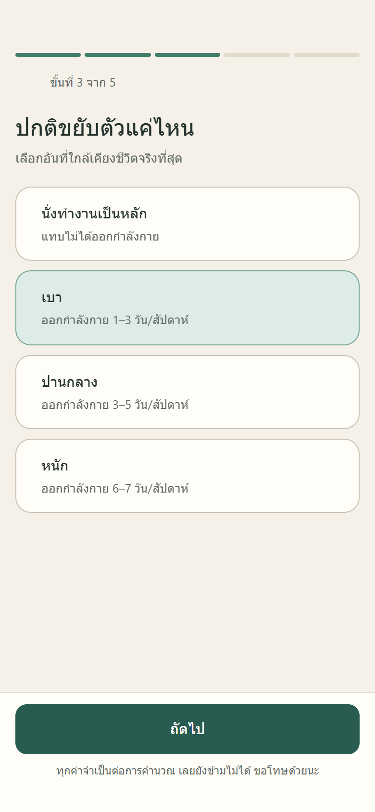

### Goal
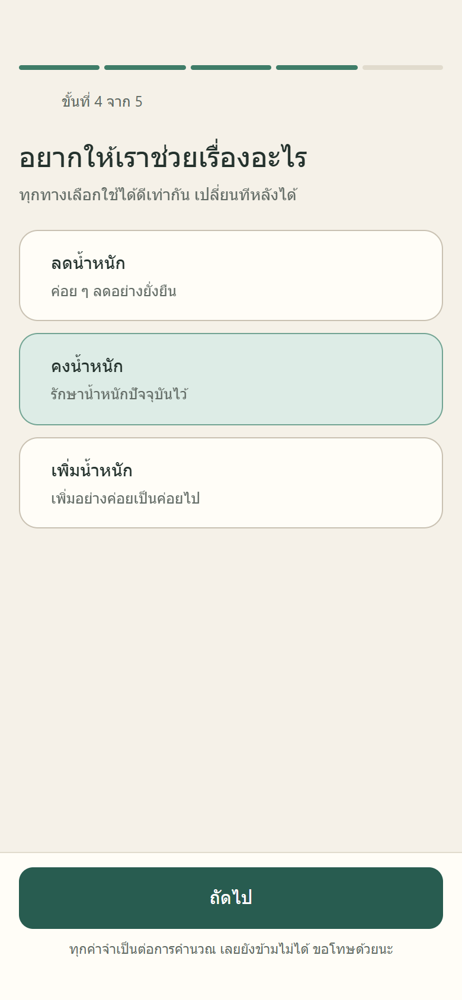

### Calculated target
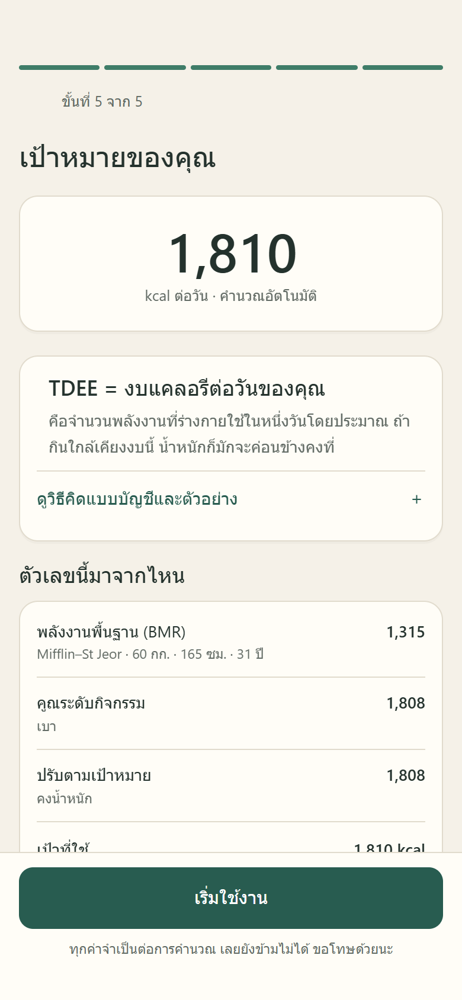

## Daily logging

### Empty day
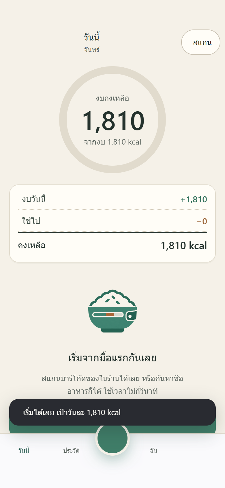

### Recent foods
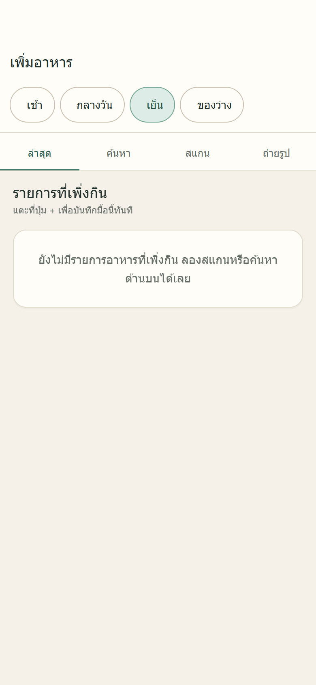

### Thai search
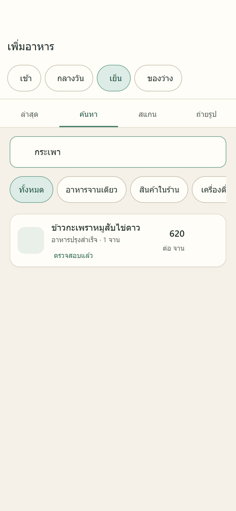

### Quantity sheet
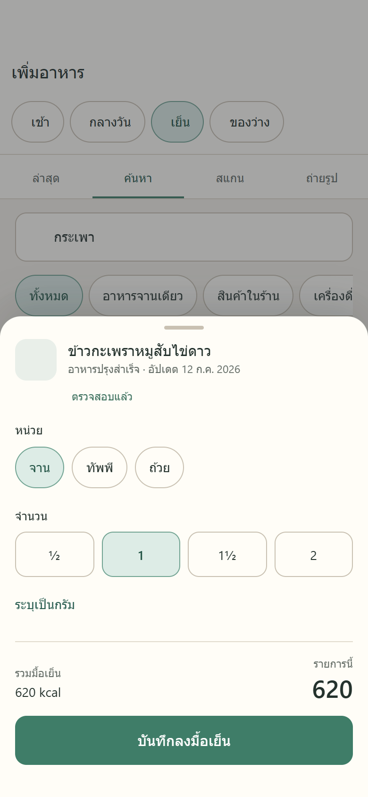

### Day with an entry
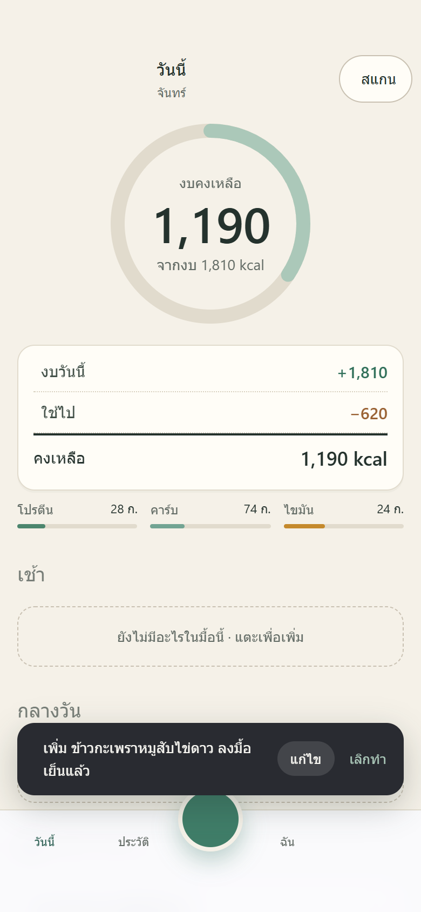

### History
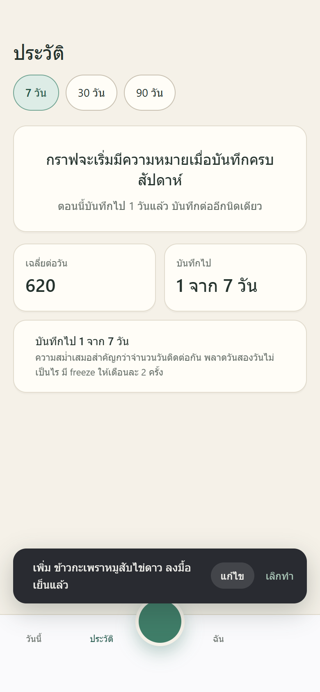

### Profile
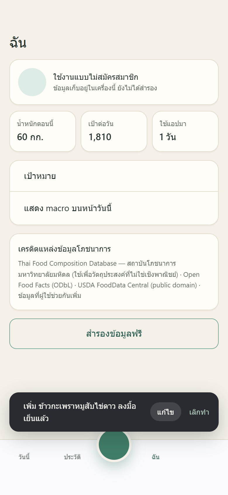

### Barcode scan
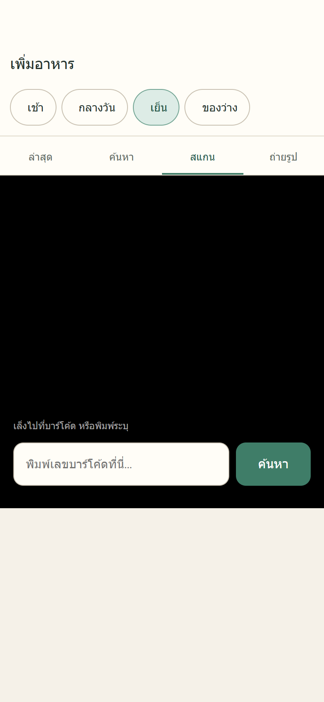

### Photo analysis
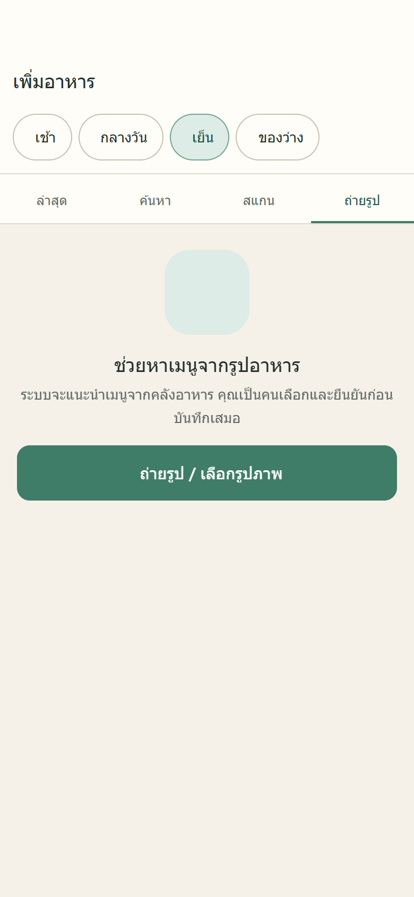
